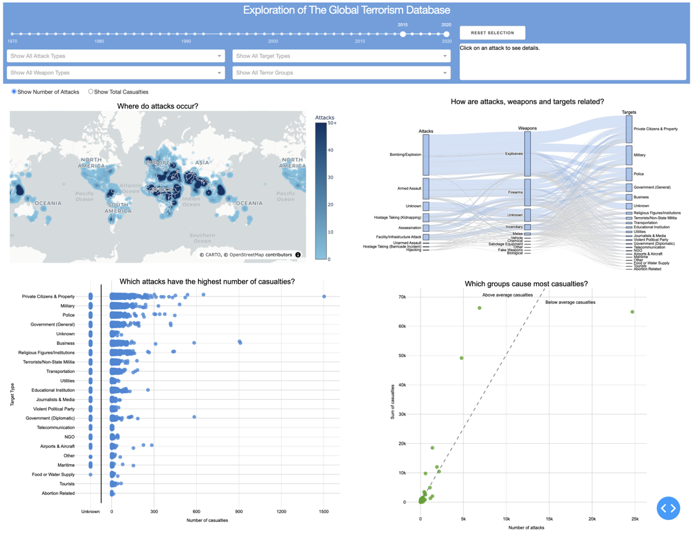
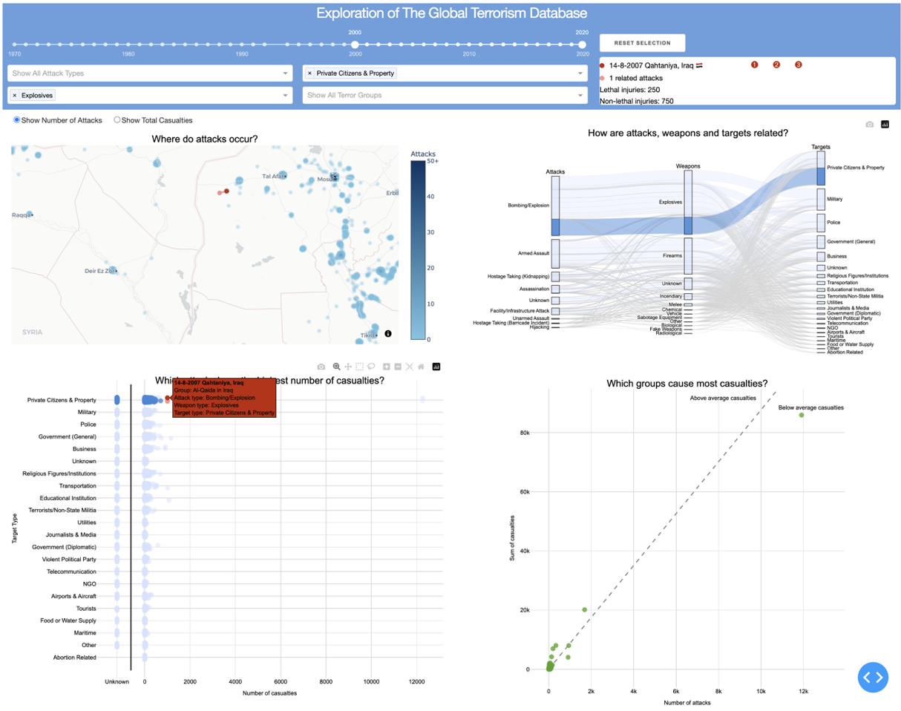
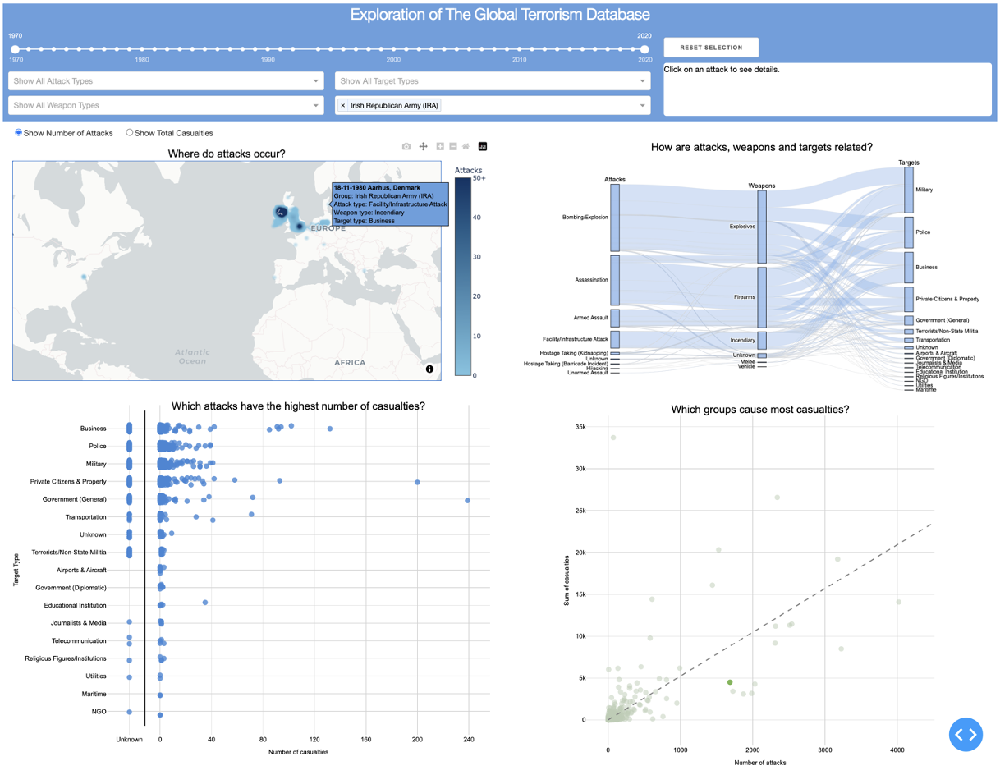

# Exploration of the Global Terrorism Database
This is an exam project in Data Visualization at Aarhus University.<br> 
The project is created by Data Science students [@AndreasHansenAU](https://www.github.com/AndreasHansenAU) and [@andr830g](https://www.github.com/andr830g).<br>

We aim to create a project, which allows users with no prior knowledge of terrorism to explore, learn about and compare historic terrorist attacks. <br>

The data used in this project comes from [The Global Terrorism Database](http://apps.start.umd.edu/gtd/), which is a publicly accessible collection of historic terrorist attack from 1970-2020.<br>


## What is it?
<p align="center">
  
</p>
The visualiztion consists of a menu bar, an info box and 4 coordinated views.<br>

1. A heatmap showing the density of terrorist attacks across the world. The heatmap automatically adjusts when zooming and panning, allowing users to zoom in on the density at a specific area. An individual attack may be selected by clicking on it.
2. A parallel sets showing the distibution of attacks and relations between attack type, primary weapon type and primary target type. Filters can be applied by clicking on a category box or a set. It allows the user to quickly identify common relations.
3. A beeswarm plot showing each attack mapped by the target type and number of total casualties. It allows the user to quickly identify the most severe attacks. An individual attack may be selected by clicking on it.
4. A scatterplot showing each terrorist group mapped to the total amount of casualties and number of attacks. A group filter can be applied by clicking on one or more groups. It allows the user to quickly identify which groups are the most dangerous.

The menu bar displays the currently selected data filters (if any), and also allows for manual selection of filters. The info box displays details of an individual attack, if any are selected.<br>


## What can I learn?
### Use case 1:
Find the most deadly attack in 2000-2020, where the attackers used explosives and targeted private citizens or private property.

<p align="center">
  
</p>

* The user has moved the year slider to select the range 2000-2020.

In the parallel sets, the user sees that a lot of attacks involving explosives are targeted at private citizens or property, and want to look into this relation.

* The user selects "Explosives" in weapons and "Private Citizens & Property" in targets.

In the beeswarm plot, the user sees that some attacks are highlighted, and clicks on the rightmost blue point. For context, the user can see that the worst attack targeting private citizens and involving explosives is not nearly as severe as the most severe attack targeting private citizens.

* The user has selected an attack.

The selected attack is highlighted in red and another point is highligted in pink. The info box reveals that this is a related attack, and the user may scroll to see further details. The heatmap reveals that both attacks occured in Iraq, outside of Mosul.<br>


### Use case 2: 
Investigate the operation of groups that perform many attacks, but cause fewer casualties per attack than the mean of all groups.

<p align="center">
  
</p>

* The user has moved the year slider to select the range 1970-2020.
* The user zooms in on the group plot.
* The user selects one of the groups that lay below the average line, which in this case is the IRA.

In the parallel sets, the user sees that the IRA often targets the military and police, contrary to private citizens. The user also discovers that the IRA often performs assasinations, which may explain why the casualty count is small, while the attack count is high.<br>
In the heatmap, the user sees that almost all attacks occur in Great Britain and Ireland. The user is also shocked to find out, that the IRA performed an attack in Aarhus, as the user lives in Aarhus, but has never heard about it.<br>


# Citations
```bibtex
@online{GTD,
    title={Global Terrorism Database 1970 - 2020},
    author={START (National Consortium for the Study of Terrorism and Responses to Terrorism)},
    year={2022},
    url={http://apps.start.umd.edu/gtd/}
}
```

